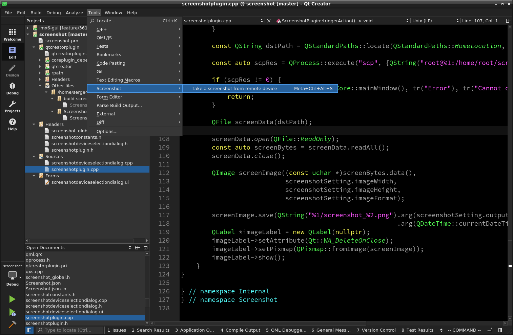
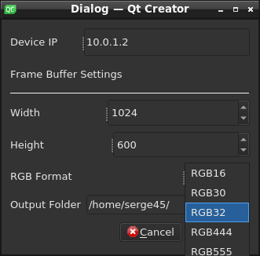

# QTC-Screenshot
A Qt Creator plugin for taking screenshot of remote(ssh) device

## How to Build
Just follow the [plugin building flow](https://doc-snapshots.qt.io/qtcreator-extending/first-plugin.html) from the official Qt site.

## Limitation
 - Support connection via SSH only
 - Default frame buffer device on remote device is `/dev/fb0`
 - Supported RGB formats are
   - RGB16
   - RGB30
   - RGB32
   - RGB444
   - RGB555
   - RGB666
   - RGB888

## How to Use
After successfully installed the plugin, you will see a Screenshot menu on tools tab of Qt Creator's menu bar. 
click **Take a Screenshot from remote device** action, a dialog with some options would appear, 
You can adjust the IP address of remote device and frame buffer settings such as width, height and RGB format there,
then click ok. If screenshot was taken successfully, 
a QLabel with screenshot content would appear and the corresponding PNG image would save to the export folder with naming
`screenshot_<current_date_time>.png`

### Screenshot Menu Action

### Screenshot Setting Dialog

